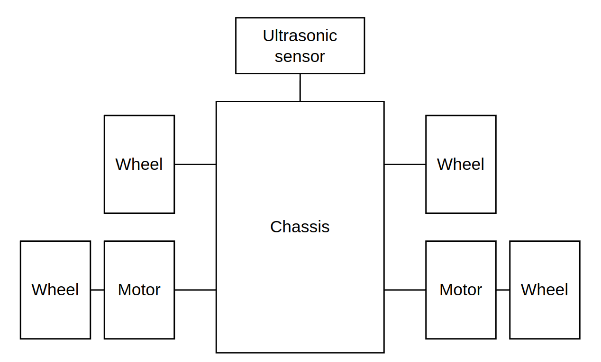
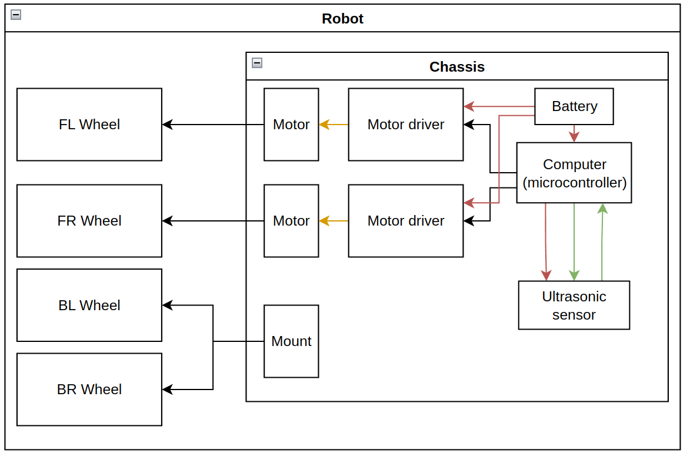

# The basic basic bot
Taking everything about the description of the bot, 

>There are many ways we can accomplish this task. In an effort to keep things simple, we will be going through a 4 wheeled robot, with 2 of its wheels driven. It will also have an ultrasonic sensor attached to it's front for presence detection.

at face value, we can come up with the following diagram: 

However, this isn't the full picture. Motors don't just spin by themselves, and ultrasonic sensors don't just shoot out beams of sound whenever they feel like it. Other devices are needed to interface with these systems!

# The more realistic basic bot

This is a lot of things to look at, so let's break it down: 

The motor is connected to a motor driver. As the name suggests, it's entire job is to drive the motor. The motor driver itself is connected to a computer, more specifically a microcontroller. 

> You can think of a microcontroller as a specialised computer for now. It will be where your code lives and the device through which your code interacts with the outside world.  

The ultrasonic sensor is also connected to the microcontroller, which is in-charge of 'taking' and 'receiving' measurements.

Everything also needs to be powered! We will use a battery to do this. 

## Power and signal 
There are 2 main types of connections between devices in the system: power lines and signal lines. 

> The exception to this rule is the connection between motor and motor driver, which is using a pulsed power line, making it in-between a power and signal line 

Power lines, as the name suggests, carries power. Without this connection, none of the electrical component would turn on. 

> Although it is only 1 wire in the diagram above, it will be 2 in real life: power and ground.

Signals lines are the main way for different parts of the system to communicate with each other. The motor driver takes in signals from the microcontroller so it knows what to output to the motor. The microcontroller also tells the ultrasonic sensor when to send out a sound pulse, and will read the output from the ultrasonic sensor to figure out how long it took for the sound pulse to come back.
