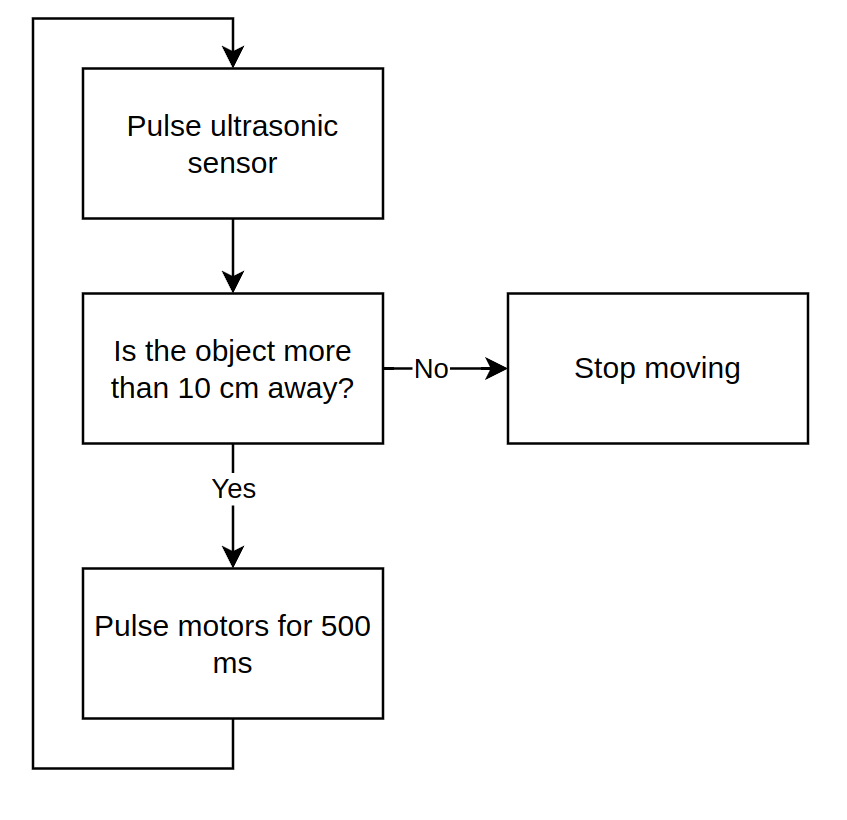
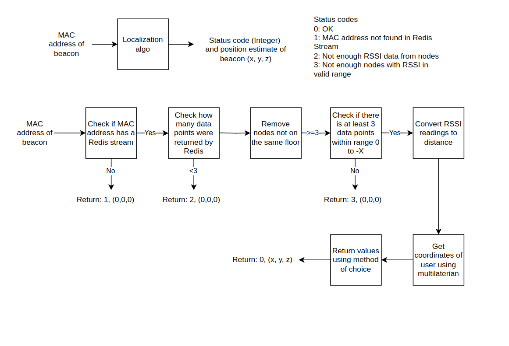

# Software magic 
So once you have everything wired up and mounted, there's one last part which is left: 
the code. 

Your code content will be heavily dependent on the type of hardware you're using, but the generic logic flow of your program shouldn't change too much. As such, it's (usually) a good idea to sketch out your ideas for the code; this can be a bunch of arrows and boxes on a piece of paper, pseudo-code, or even a properly drawn out flowchart on a diagramming software. 

For the sake of this book, here's an example of the last option for our Basic Bot:

Flow diagrams can also be used to describe error messages along with code flow: 

> At the end of the day, the goal of **any** diagram is to communicate with other people (including your future self). There is no reason to make a diagram more verbose than it needs to be, but it shouldn't be so simple it serves no purpose either than to look pretty. First decide who you are communicating to and all other details will fall in place. 
