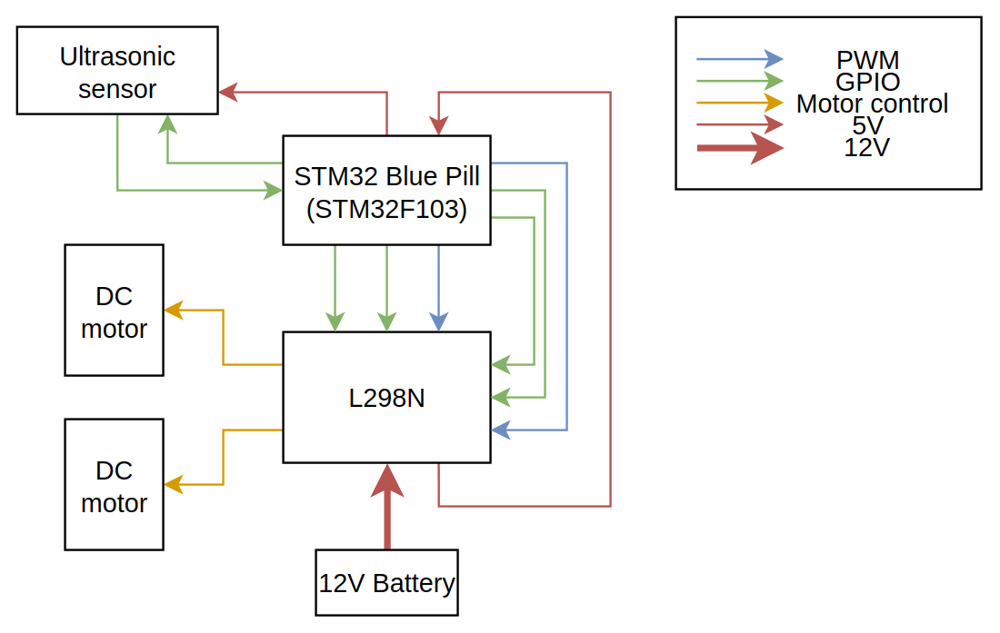
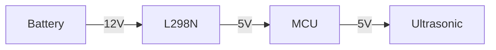

# System architecture 

There are 3 major changes in the system architecture: 
- Number of motor drivers 
- Two different voltage (power) lines 
- Two different signal lines 

The number of motor drivers were reduced as the motor driver chosen, the L298N, is capable of driving two motors at once, making a second motor driver redundant. 

A distinction has only been made between voltage lines, with the battery powering the L298N module, the L298N module powering the MCU and the MCU powering the ultrasonic sensor. This is because the battery will output 12 V, while the MCU requires 5 V.

Power flow:

> Certain MCUs can accept 12 V, check the datasheet! 

Finally, the signal lines have been broken down into GPIO(General Purpose Input Output) and PWM(Pulse Width Modulation). The distinction is important as most MCUs have PWM pins limited to a few pins on the board. The extra information provided by this diagram would allow them to build their circuits without having to comb through the datasheets of both the MCU and the L298N module. 

> GPIO pins in this case refer to pins which have been configured for normal/non-unique input and output tasks. 
