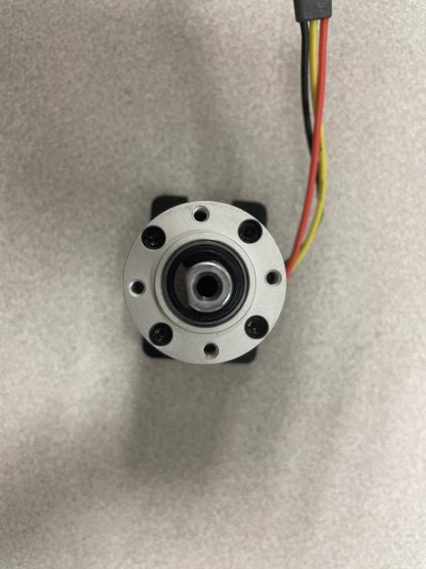
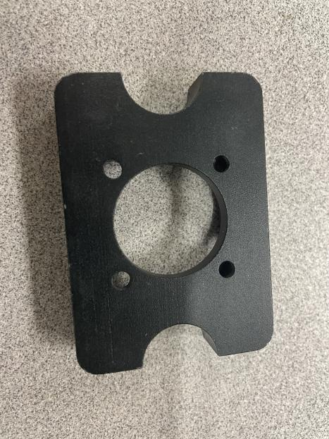
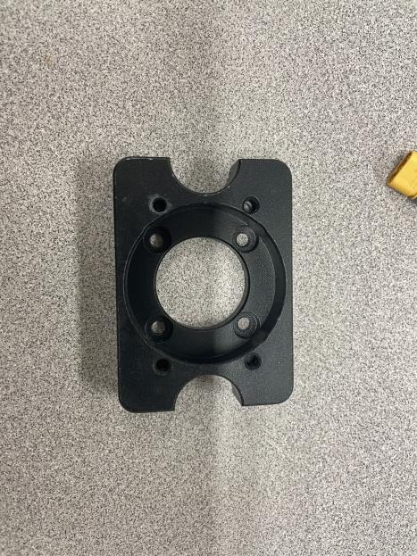
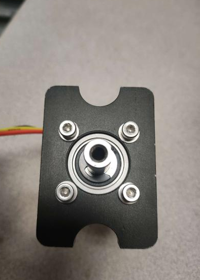
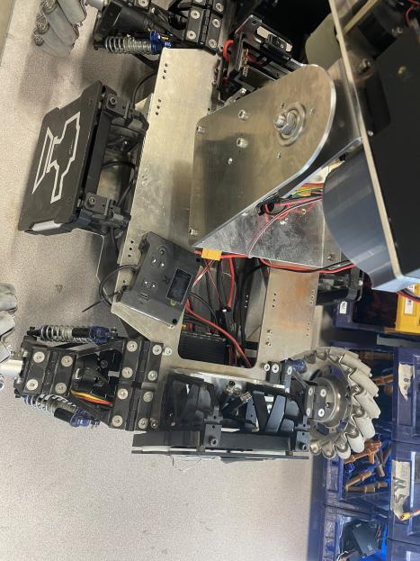

# Things don't float and matter takes up space
All of the components listed earlier need to be attached to the chassis. Although superglue and duct tape can solve a lot of problems, it's good practice to plan out more permanent mounting solutions when picking your components. 

For example, motors usually come with mounting holes; these holes can be used to mount the motor using a L-bracket or a custom mount. Most [PCBs](https://en.wikipedia.org/wiki/Printed_circuit_board)(Printed Circuit Board) also come with mounting holes for this purpose.

> Motor with mounting holes

> Mounting bracket, front

> Mounting bracket, back

> Mounted motor 

Although wires might just be lines on your diagram, they WILL take up space in your robot. Care needs to be taken when designing your mounts and chassis to ensure there is enough space to do your wire management. 

